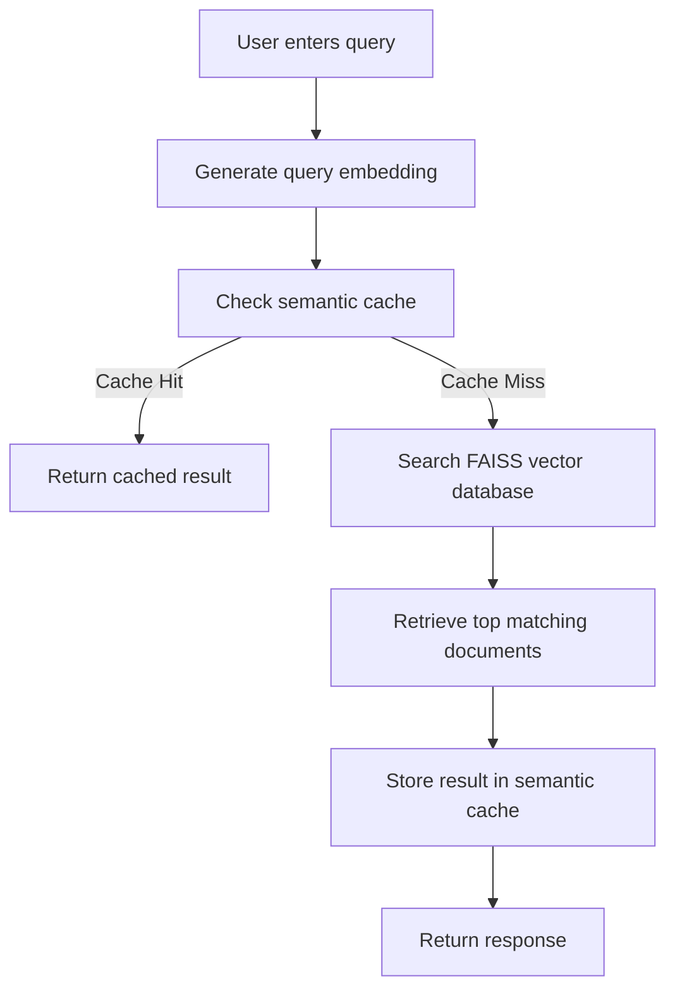

# Semantic News Search System


AI & ML Engineer Assignment – Trademarkia

This project implements a semantic search system over the **20 Newsgroups dataset (~20,000 documents)** using vector embeddings, fuzzy clustering, and a semantic caching mechanism built from scratch.

The system demonstrates how semantic understanding can improve search efficiency while reducing redundant computations through intelligent caching.

---

# System Overview

The project implements three core components required in the assignment:

1. **Embedding & Vector Database**
2. **Fuzzy Clustering of Documents**
3. **Semantic Cache Layer**
4. **FastAPI Service exposing the system**

Users can submit natural language queries and retrieve semantically relevant documents from the dataset.

---

# System Architecture


This diagram illustrates the high-level architecture of the semantic search system.

A user query first reaches the FastAPI service, where the query is embedded using the same embedding model used for the corpus. The system then checks the semantic cache to determine whether a similar query has already been processed.

If a similar query exists above the similarity threshold, the cached result is returned immediately. Otherwise, the system performs a vector similarity search using FAISS to retrieve relevant documents and stores the result in the cache for future reuse.

---

# Query Processing Flow



This flow diagram describes how the system processes each incoming query.

1. The user submits a natural language query.
2. The query is converted into an embedding using the Sentence Transformers model.
3. The semantic cache checks whether a similar query has already been processed.
4. If a match above the similarity threshold is found, the cached result is returned.
5. Otherwise, the system performs a FAISS vector search to retrieve semantically similar documents.
6. The result is stored in the semantic cache for future reuse.

This mechanism allows the system to avoid redundant computations when users submit semantically similar queries.

---

# Dataset

Dataset used:

https://archive.ics.uci.edu/dataset/113/twenty+newsgroups

The dataset contains:

- ~20,000 Usenet posts
- 20 topic categories
- noisy real-world text data

---

# Data Preprocessing

The dataset contains noise such as:

- email headers
- reply markers (`>`)
- unnecessary whitespace
- formatting artifacts

These elements do not contribute to semantic meaning and were removed during preprocessing.

Cleaning steps include:

- lowercasing text
- removing email headers
- removing quoted replies
- removing special characters
- whitespace normalization

This improves embedding quality and semantic retrieval accuracy.

---

# Embedding Model

Embedding model used:

sentence-transformers/all-MiniLM-L6-v2

Reasons for this choice:

- Lightweight and fast
- Produces 384 dimensional embeddings
- Good semantic similarity performance
- Suitable for CPU environments

Each document in the corpus is converted into an embedding vector.

---

# Vector Database

Vector database used:

FAISS (Facebook AI Similarity Search)

Reasons:

- Extremely fast similarity search
- Optimized for high dimensional embeddings
- Efficient for datasets of this size (~20k documents)

The FAISS index stores all document embeddings and supports fast nearest-neighbor search for query embeddings.

---

# Fuzzy Clustering

Traditional clustering assigns each document to one cluster only.

However, documents in the real world often belong to multiple topics simultaneously.

Example:

A document discussing gun legislation may belong to **politics, firearms, and law**.

Therefore **Fuzzy C-Means clustering** was used.

Each document receives a probability distribution across clusters.

Example membership distribution:

Cluster 3 → 0.62  
Cluster 7 → 0.28  
Cluster 1 → 0.10

The API returns the **dominant cluster** for interpretability.

---

# Number of Clusters

The system uses **12 clusters**.

This value was chosen after experimentation:

- Fewer clusters merged unrelated topics
- Too many clusters fragmented coherent topics

12 clusters produced interpretable semantic groups such as:

- space exploration discussions
- computer hardware discussions
- political debates
- motorcycle discussions

---

# Semantic Cache

Traditional caches only work for exact query matches.

Example:

space shuttle launch

vs

NASA rocket launch mission

These queries mean the same thing but traditional caches treat them differently.

This project implements a **semantic cache from first principles**.

Cache mechanism:

1. Query is converted into an embedding
2. The cache stores embeddings of previous queries
3. Cosine similarity is computed between queries
4. If similarity exceeds a threshold, cached results are reused

---

# Cache Similarity Threshold

Similarity threshold used:

0.75

This threshold balances:

- precision (avoid unrelated matches)
- cache reuse (increase hit rate)

Lower thresholds caused incorrect cache matches. Higher thresholds significantly reduced cache effectiveness.

---

# Technologies Used

- **Sentence Transformers** – generating semantic embeddings
- **FAISS** – high-performance vector similarity search
- **Fuzzy C-Means (scikit-fuzzy)** – soft clustering
- **FastAPI** – API framework
- **NumPy / Pandas** – data processing
- **Docker** – containerization

---

# FastAPI Service

The system exposes a REST API.

Start the service with:

```
uvicorn main:app --reload
```

The API runs on:

```
http://localhost:8000
```

---

# API Endpoints

## POST /query

Request:

```json
{
  "query": "space shuttle launch"
}
```

Response:

```json
{
  "query": "space shuttle launch",
  "cache_hit": false,
  "matched_query": null,
  "similarity_score": null,
  "result": "...",
  "dominant_cluster": 9
}
```

On cache hit:

```json
{
  "query": "NASA rocket launch",
  "cache_hit": true,
  "matched_query": "space shuttle launch",
  "similarity_score": 0.89,
  "result": "...",
  "dominant_cluster": 9
}
```

---

## GET /cache/stats

Returns cache statistics.

---

## DELETE /cache

Clears the cache and resets statistics.

---

# Project Structure

```
semantic-news-search
│
├── data
├── experiments
│
├── frontend
│   ├── index.html
│   ├── script.js
│   └── style.css
│
├── models
│   ├── embeddings.npy
│   ├── documents.pkl
│   ├── faiss.index
│   └── cluster_model.pkl
│
├── src
│   ├── api
│   │   └── routes.py
│   │
│   ├── cache
│   │   └── semantic_cache.py
│   │
│   ├── clustering
│   │   └── fuzzy_cluster.py
│   │
│   ├── data_loader
│   │   └── load_dataset.py
│   │
│   ├── embeddings
│   │   └── embedder.py
│   │
│   ├── preprocessing
│   │   └── clean_text.py
│   │
│   └── vector_store
│       └── faiss_store.py
│
├── main.py
├── requirements.txt
├── Dockerfile
└── README.md
```

---

# Running the Project

Create virtual environment:

```
python -m venv venv
```

Activate environment:

```
venv\Scripts\activate
```

Install dependencies:

```
pip install -r requirements.txt
```

Start server:

```
uvicorn main:app --reload
```

Open API docs:

```
http://localhost:8000/docs
```

---

# Docker

Build container:

```
docker build -t semantic-news-search .
```

Run container:

```
docker run -p 8000:8000 semantic-news-search
```

Then open:

```
http://localhost:8000
```

---

# Key Features

- Semantic search over 20k documents
- FAISS vector database
- Sentence Transformer embeddings
- Fuzzy clustering for topic discovery
- Semantic cache built from scratch
- FastAPI backend
- Interactive frontend UI
- Docker support

---

# Conclusion

This project demonstrates how semantic embeddings, clustering, and intelligent caching can be combined to build an efficient semantic search system capable of understanding natural language queries and reducing redundant computation.
